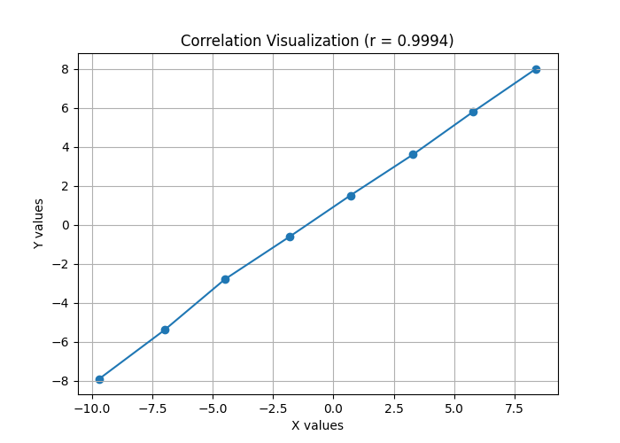

# Pearson Correlation Visualization
# Student: Otar Tagviashvili

##  Overview
This project demonstrates how to calculate **Pearson correlation (r)** between two variables and visualize their relationship using **Python**.

The task includes:
- Using the **Pearson correlation formula**
- Computing correlation with Python
- Visualizing the data points and their linear relationship

---

##  Dataset
The following coordinates are used in this task:

| X | Y |
|----|----|
| -9.70 | -7.90 |
| -7.00 | -5.40 |
| -4.50 | -2.80 |
| -1.80 | -0.60 |
| 0.70 | 1.50 |
| 3.30 | 3.60 |
| 5.80 | 5.80 |
| 8.40 | 8.00 |

---

## Pearson Correlation Formula

The Pearson correlation coefficient is calculated using the formula:

\[
 r = \frac{\sum_{i=1}^{n} (x_i - \bar{x})(y_i - \bar{y})}
 {\sqrt{\sum_{i=1}^{n} (x_i - \bar{x})^2 \sum_{i=1}^{n} (y_i - \bar{y})^2}}
\]

Where:
- \(x_i, y_i\) are data points
- \(\bar{x}, \bar{y}\) are mean values
- \(n\) is the number of points

---

##  Result

The calculated Pearson correlation coefficient is:

```
r ≈ 0.9994
```

### Interpretation 
- The value is **very close to +1**
- This shows a **very strong positive linear correlation**
- When X increases, Y also increases almost perfectly

---


##  Visualization Explanation

- The scatter plot shows data points placed almost on a straight line
- The line confirms the strong linear relationship
- Visualization supports the numerical result of **high positive correlation**

<p align="center">
  
</p>


---

##  Conclusion

This task shows how Pearson correlation can be calculated and visualized using Python. The results clearly indicate a **strong positive linear relationship** between the given variables.

This example is useful for learning **statistics, machine learning basics, and data analysis**.

