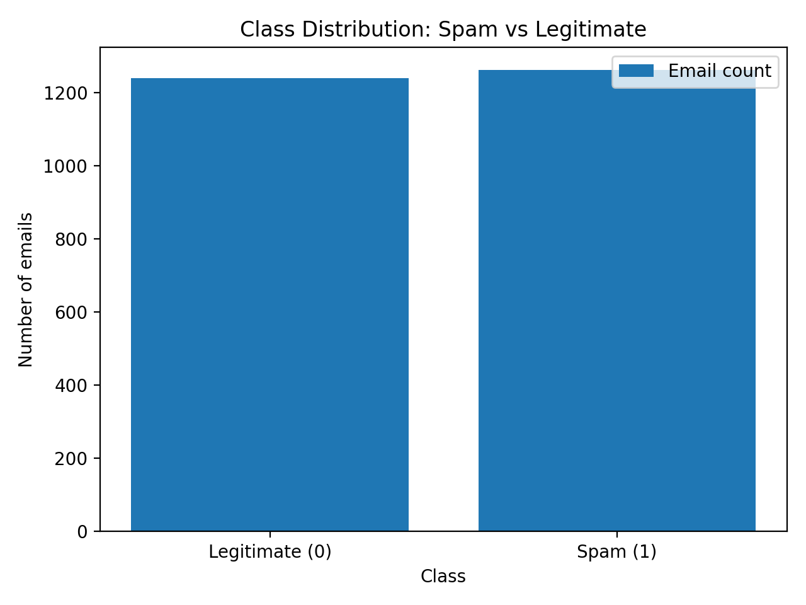
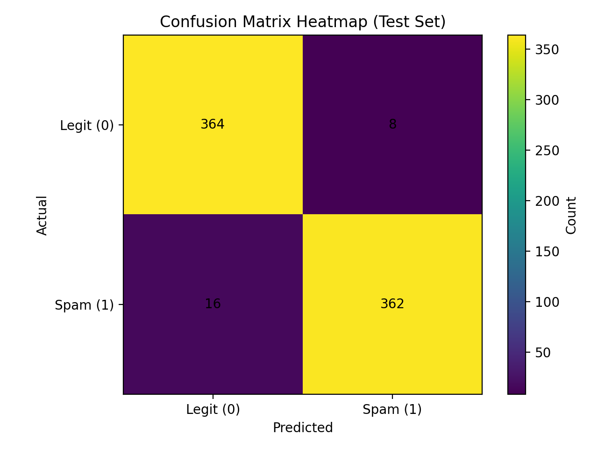
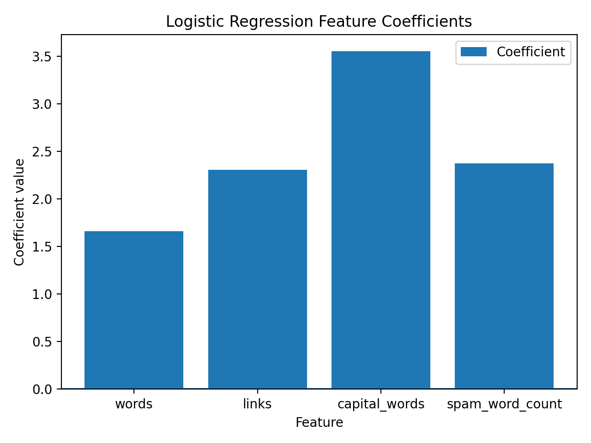

# Spam Detection with Logistic Regression
# Student: Otar Tagviashvili

Repository structure (important files):

- **Data**: `data/o_tagviashvili25_61845.csv`
- **Training + evaluation**: `src/train_logreg.py`
- **Feature extraction from raw email text**: `src/features.py`
- **Predict (classify a new email text)**: `src/predict.py`
- **Visualizations**: `src/visualize.py` (outputs images into `reports/figures/`)

---

## 1) Data file upload (GitHub requirement)

Data file is uploaded in this repo:

- `data/o_tagviashvili25_61845.csv`


---

## 2) Train Logistic Regression on 70% of the data

### Data loading + processing code (what it does)
1. Loads the CSV with pandas  
2. Uses these **4 numeric features**:
   - `words`, `links`, `capital_words`, `spam_word_count`
3. Splits the dataset into **70% train / 30% test** using stratification (keeps class ratio similar)
4. Trains a Logistic Regression model (with feature scaling)

### Code snippet (from `src/train_logreg.py`)
```python
df = pd.read_csv(DATA_PATH)

feature_cols = ["words", "links", "capital_words", "spam_word_count"]
label_col = "is_spam"

X = df[feature_cols].copy()
y = df[label_col].copy()

X_train, X_test, y_train, y_test = train_test_split(
    X, y,
    test_size=0.30,
    random_state=42,
    stratify=y
)

model = Pipeline(steps=[
    ("scaler", StandardScaler()),
    ("logreg", LogisticRegression(max_iter=1000, random_state=42))
])

model.fit(X_train, y_train)
```

---

## 3) Validation on the 30% test set (Confusion Matrix + Accuracy)

### Results (test set)
- **Accuracy:** 0.9680
- **Confusion Matrix** (format `[[TN, FP],[FN, TP]]`):

```
[[364, 8],
 [16, 362]]
```

### Code snippet (from `src/train_logreg.py`)
```python
y_pred = model.predict(X_test)
cm = confusion_matrix(y_test, y_pred)
acc = accuracy_score(y_test, y_pred)
```

---

## 4) Classify raw email text (parse → extract features → predict)

The application extracts the SAME 4 features from an email text:

- `words`: number of words (regex-based tokenization)
- `links`: number of URLs (`http(s)://...` or `www...`)
- `capital_words`: count of fully uppercase words (like `URGENT`, `FREE`)
- `spam_word_count`: count of words from a spam keyword list (example: `free, win, prize, cash, urgent, offer, click, discount...`)

### Feature extraction code (from `src/features.py`)
```python
def extract_features(email_text: str) -> Dict[str, int]:
    words_list = WORD_RE.findall(email_text)
    words = len(words_list)

    links = len(URL_RE.findall(email_text))

    capital_words = sum(
        1 for w in words_list if len(w) > 1 and w.isalpha() and w.isupper()
    )

    spam_word_count = sum(
        1 for w in words_list if w.lower() in SPAM_SET
    )

    return {
        "words": words,
        "links": links,
        "capital_words": capital_words,
        "spam_word_count": spam_word_count,
    }
```

### Predict command
```bash
python -m src.predict --file samples/spam_email.txt
python -m src.predict --file samples/legit_email.txt
```

---

## 5) Manually composed email that is classified as **SPAM**

**Email text** (file: `samples/spam_email.txt`)
```text
Subject: URGENT! You are a WINNER – claim your FREE cash prize now!

Congratulations!
You have been selected for an exclusive limited offer. WIN CASH BONUS today.

Click now to claim: https://tinyurl.com/claim-prize-now
Act NOW to receive your money reward.

Best regards,
Promo Team
```

**Why it becomes spam:** it contains many spam keywords (**FREE, WINNER, cash, claim, urgent, offer**), a URL link, and multiple uppercase words, which increases `spam_word_count`, `links`, and `capital_words` → the model predicts **SPAM**.

---

## 6) Manually composed email that is classified as **LEGITIMATE**

**Email text** (file: `samples/legit_email.txt`)
```text
Subject: Meeting notes and next steps for Monday

Hi team,

Thanks for the productive meeting today. I attached the notes and the updated task list.
Please review the action items and reply with any comments before Monday morning.

Best,
Otar
```

**Why it becomes legitimate:** the text looks like normal work email, with no “spam keywords”, almost no uppercase words, and no promotional links → low values for spam-like features → the model predicts **LEGITIMATE**.

---

## 7) Visualizations (Matplotlib)

Run:
```bash
python -m src.visualize
```

### Visualization 1: Class Distribution
Python code is in `src/visualize.py` (`plot_class_distribution`).



**Explanation:** This bar chart shows how many emails are labeled as legitimate vs. spam. If one class is much larger, the dataset is imbalanced and accuracy alone can be misleading. Here, the counts are close, so training is not strongly biased toward one class.

### Visualization 2: Confusion Matrix Heatmap
Python code is in `src/visualize.py` (`plot_confusion_matrix_heatmap`).



**Explanation:** This heatmap shows the number of correct and incorrect predictions on the test set. The diagonal cells (TN and TP) represent correct classifications, while off-diagonal cells (FP and FN) are errors. The small off-diagonal values indicate the model performs well on both classes.

### (Optional) Visualization 3: Feature Coefficients
Python code is in `src/visualize.py` (`plot_feature_coefficients`).



**Explanation:** This chart shows the learned coefficient for each feature in Logistic Regression. Larger positive coefficients push the prediction toward spam (class 1). `capital_words` has the highest coefficient here, suggesting uppercase “shouting” words are a strong indicator of spam for this dataset.

---

## Model coefficients (from the trained model)

Intercept: **2.143776**

| Feature | Coefficient |
|---|---:|
| words | 1.662347 |
| links | 2.306175 |
| capital_words | 3.551046 |
| spam_word_count | 2.375552 |

---

## How to run locally (quick)

```bash
pip install -r requirements.txt
python -m src.train_logreg
python -m src.visualize
python -m src.predict --file samples/spam_email.txt
```

